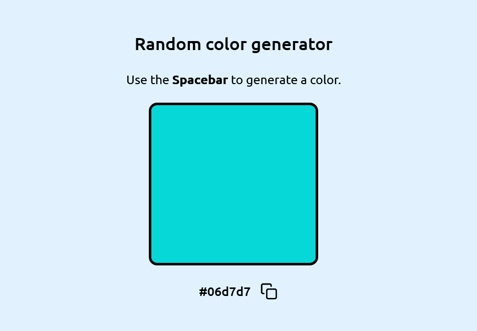

# Random color generator using vanilla javascript

## How to use
- Press the Spacebar to generate a random color
- Click on the clipboard icon to copy the corresponding hex value
- Click [here](https://kiruanime2003.github.io/random-color-generator/) for a live preview

Author - [Kiruthiga K](https://kiruanime2003.gitlab.io/)

